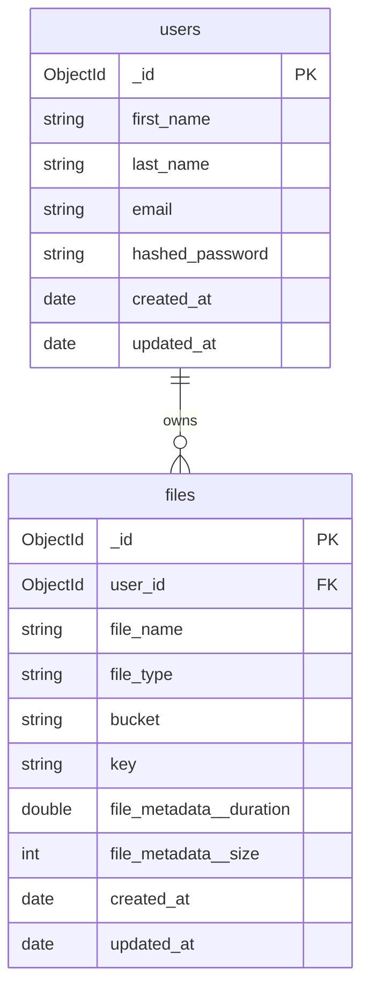

# Database Model

MongoDB (Atlas). Two collections managed by Beanie ODM.

---

## Collections

### users

| Field             | BSON Type | Notes                              |
|-------------------|-----------|------------------------------------|
| `_id`             | ObjectId  | Primary key (auto)                 |
| `first_name`      | String    | Required                           |
| `last_name`       | String    | Required                           |
| `email`           | String    | Required · unique index            |
| `hashed_password` | String    | bcrypt hash — never returned in API responses |
| `created_at`      | Date      | Set on insert via Beanie hook      |
| `updated_at`      | Date      | Set on insert + update via Beanie hook |

Indexes: `email` (unique)

---

### files

| Field                      | BSON Type | Notes                                          |
|----------------------------|-----------|------------------------------------------------|
| `_id`                      | ObjectId  | Primary key (auto)                             |
| `user_id`                  | ObjectId  | FK → `users._id` · indexed                    |
| `file_name`                | String    | Original filename                              |
| `file_type`                | String    | MIME type (e.g. `audio/mpeg`)                  |
| `bucket`                   | String    | S3 bucket name                                 |
| `key`                      | String    | S3 object key (`users/{uid}/audio/{uuid}.ext`) |
| `file_metadata.duration`   | Double    | Seconds — best-effort via mutagen, nullable    |
| `file_metadata.size`       | Int64     | Bytes                                          |
| `created_at`               | Date      | Set on insert via Beanie hook                  |
| `updated_at`               | Date      | Set on insert + update via Beanie hook         |

Indexes: `user_id`

`file_url` is **never stored** — it is a presigned S3 GET URL computed at read time from `bucket` + `key`.

---

## ERD (Mermaid)

---

## Notes

- `file_metadata` is an embedded sub-document (not a separate collection).
- `duration` may be `null` if mutagen cannot parse the file — upload never fails because of it.
- Soft-delete is not implemented; `DELETE /audio/{id}` removes the S3 object and the `files` document permanently.
- Pagination on `GET /audio` is offset-based, sorted `created_at` descending (newest first).
